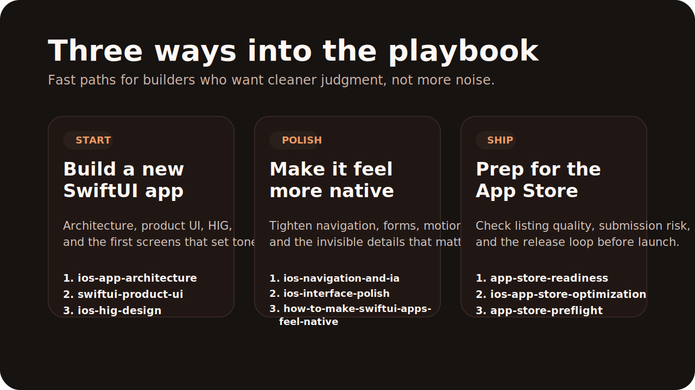

# iOS App Playbook


An opinionated open-source playbook for designing, building, and shipping polished iOS apps.

Built for intermediate solo builders who already know how to compile an app, but want sharper judgment around SwiftUI product UI, clean native design, App Store readiness, and indie shipping quality.

Authored by [@phrypy](https://instagram.com/phrypy).

Published on GitHub at [khbyong/ios-app-playbook](https://github.com/khbyong/ios-app-playbook).

## What This Repo Is

This is not just a pile of prompts or a random design dump.

It is a practical iOS playbook with four layers:

- `skills/`
  - Reusable agent skills for architecture, UI, review, shipping, and native iOS design decisions
- `guides/`
  - Human-readable playbooks for common product design problems
- `checklists/`
  - Fast review passes before shipping or submitting
- `references/`
  - Canonical Apple links and source material worth keeping close

The content is organized around three outcomes:

- `Design`
  - native structure, navigation, forms, settings, empty states, accessibility
- `Polish`
  - interface feel, motion restraint, hierarchy, icon clarity, brand consistency
- `Ship`
  - App Store readiness, listing quality, release flow, review-risk reduction

## Who This Is For

- solo founders and indie iOS builders
- intermediate SwiftUI developers
- product-minded engineers who care about native feel
- builders shipping consumer apps, utilities, finance apps, creator tools, or productivity apps

This repo is not aimed at:

- total beginners learning Swift for the first time
- enterprise architecture committees
- web-to-mobile ports that want to keep web-native UX patterns intact

## Start Here

### If you are starting a new app

- `skills/ios-app-architecture`
- `skills/swiftui-product-ui`
- `skills/ios-hig-design`

### If your app works but doesn’t feel native enough

- `skills/ios-navigation-and-ia`
- `skills/ios-forms-and-input-design`
- `skills/ios-motion-and-microinteractions`
- `skills/ios-interface-polish`
- `guides/how-to-make-swiftui-apps-feel-native.md`

### If the product works but still feels under-polished

- `skills/ios-interface-polish`
- `skills/ios-app-icon-optimization`
- `skills/ios-app-icon-and-brand-system`

### If your Settings or sync flows feel risky or unclear

- `skills/ios-settings-and-data-safety-ux`
- `guides/how-to-design-a-clean-ios-settings-screen.md`

### If you are getting close to shipping

- `skills/app-store-readiness`
- `skills/ios-app-store-optimization`
- `skills/solo-ios-release-flow`
- `checklists/app-store-preflight.md`
- `checklists/app-store-listing-review.md`
- `checklists/accessibility-review.md`

## Recommended Paths



### Path 1: Build a new SwiftUI app

1. `ios-app-architecture`
2. `swiftui-product-ui`
3. `ios-hig-design`

Use this path when you are shaping the foundations, first screens, and product structure.

### Path 2: Make an app feel more native

1. `ios-navigation-and-ia`
2. `ios-interface-polish`
3. `guides/how-to-make-swiftui-apps-feel-native.md`

Use this path when the app works, but the UX still feels generic, web-shaped, or slightly off.

### Path 3: Prep for the App Store

1. `app-store-readiness`
2. `ios-app-store-optimization`
3. `checklists/app-store-preflight.md`

Use this path when you need tighter metadata, better listing judgment, and a clearer pre-submit loop.

## Skills

- `ios-app-architecture`
  - Structure a solo-friendly SwiftUI codebase with clean boundaries.
- `swiftui-product-ui`
  - Build real product screens with stronger hierarchy and product judgment.
- `ios-debug-and-stabilize`
  - Triage crashes, warnings, state bugs, and shipping regressions.
- `ios-hig-design`
  - Design iPhone and iPad interfaces that feel native to Apple platforms.
- `ios-navigation-and-ia`
  - Choose better tab, drill-down, modal, and information architecture patterns.
- `ios-settings-and-data-safety-ux`
  - Design settings, sync, restore, destructive actions, and trust-sensitive flows.
- `ios-forms-and-input-design`
  - Improve forms, pickers, validation, save behavior, and keyboard/input decisions.
- `ios-empty-states-and-first-run`
  - Make onboarding, empty states, and first-session UX clearer and calmer.
- `ios-motion-and-microinteractions`
  - Add subtle motion, feedback, and haptics without making the app feel noisy.
- `ios-interface-polish`
  - Improve spacing, hierarchy, radii, feedback, and the invisible details that make apps feel finished.
- `ios-adaptive-layout`
  - Handle iPhone, iPad, safe areas, readable width, and layout changes more cleanly.
- `ios-accessibility-design-review`
  - Review Dynamic Type, contrast, hit targets, VoiceOver, and reduced motion support.
- `ios-app-icon-optimization`
  - Make the app icon clearer, more distinctive, and better suited to App Store browse and search.
- `ios-app-icon-and-brand-system`
  - Shape an app icon, lightweight brand system, and marketing consistency that still feel native.
- `app-store-readiness`
  - Preflight metadata, privacy, capabilities, and review risk.
- `ios-app-store-optimization`
  - Tighten App Store positioning, metadata, icon, and screenshot judgment without turning into generic ASO spam.
- `solo-ios-release-flow`
  - Run a sane release loop from local verification to TestFlight and App Store submission.

## Guides

- [How To Design A Clean iOS Settings Screen](./guides/how-to-design-a-clean-ios-settings-screen.md)
- [How To Design An iOS App Icon That Gets Tapped](./guides/how-to-design-an-ios-app-icon-that-gets-tapped.md)
- [How To Make SwiftUI Apps Feel Native](./guides/how-to-make-swiftui-apps-feel-native.md)
- [How To Prep An Indie iOS App For App Store Review](./guides/how-to-prep-an-indie-ios-app-for-app-store-review.md)

## Examples

- [Examples Overview](./examples/README.md)
- [Settings Sync Wording](./examples/settings-sync-wording.md)
- [Empty State Next Action](./examples/empty-state-next-action.md)
- [App Store Listing Tighten](./examples/app-store-listing-tighten.md)

## Checklists

- [Clean iOS UI Review](./checklists/clean-ios-ui-review.md)
- [App Store Preflight](./checklists/app-store-preflight.md)
- [App Store Listing Review](./checklists/app-store-listing-review.md)
- [Accessibility Review](./checklists/accessibility-review.md)

## References

- [Official Apple iOS Design Links](./references/official-ios-design-links.md)

## Use This Playbook

Paste this directly into your agent:

```text
Install the skills from https://github.com/khbyong/ios-app-playbook into my local skills directory and make them available in this session.
```

If this playbook helps, star the repo to support it and follow updates.

Fork it if you want to adapt the skills into your own workflow or publish your own version.

## Install

### Codex

Copy chosen skill folders into:

```bash
~/.codex/skills/
```

### Claude Code

Copy chosen skill folders into:

```bash
~/.claude/skills/
```

### Generic Agent Setup

If your agent supports `SKILL.md`-style folders, copy any skill directory from `skills/` into that agent’s skills directory.

## Philosophy

- SwiftUI first
- native behavior over trend-chasing
- trust-sensitive UX for settings, sync, and data
- product polish without bloated process
- ship with evidence, not vibes

## Notes

- These skills are intentionally opinionated.
- The goal is reusable judgment, not blind copying.
- If your app already has strong conventions, preserve them unless they are causing real product or maintenance problems.

Use [docs/adoption-guide.md](./docs/adoption-guide.md) for a practical setup path.
