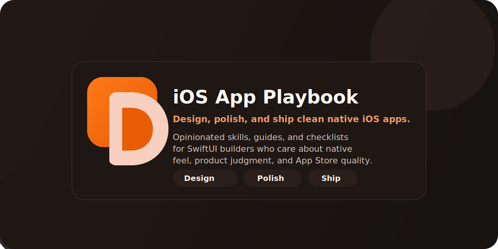

# iOS App Playbook



An open-source iOS playbook for intermediate solo builders.

**Who it's for:** Solo founders and indie iOS developers who can already build an app but want sharper judgment on SwiftUI product UI, native design, App Store quality, and shipping.

**What it is:** A structured system of agent skills, guides, checklists, and examples organized around three outcomes: Design, Polish, Ship.

**What it is not:** A beginner Swift tutorial. A pile of random prompts. An enterprise architecture spec.

Authored by [@phrypy](https://instagram.com/phrypy) · Published at [khbyong/ios-app-playbook](https://github.com/khbyong/ios-app-playbook)

---

## Recommended Path

One end-to-end path for building and shipping a polished iOS app:

| Stage | Resource |
|---|---|
| 1. Architecture | [ios-app-architecture](./skills/ios-app-architecture/) |
| 2. Product UI | [swiftui-product-ui](./skills/swiftui-product-ui/) |
| 3. Native Feel | [ios-hig-design](./skills/ios-hig-design/) + [guide](./guides/how-to-make-swiftui-apps-feel-native.md) |
| 4. Accessibility & Quality | [ios-accessibility-design-review](./skills/ios-accessibility-design-review/) + [checklist](./checklists/accessibility-review.md) |
| 5. Polish | [ios-interface-polish](./skills/ios-interface-polish/) |
| 6. App Store Preflight | [app-store-readiness](./skills/app-store-readiness/) + [checklist](./checklists/app-store-preflight.md) |
| 7. Launch | [solo-ios-release-flow](./skills/solo-ios-release-flow/) |

Use the full path for new apps. Jump to any stage when iterating on something specific.

---

## Structure

```
skills/       Agent skills for architecture, UI, review, and shipping
guides/       Human-readable playbooks for common product decisions
checklists/   Fast review passes before shipping or submitting
examples/     Short judgment samples showing playbook principles applied
references/   Canonical Apple links worth keeping close
```

---

## Skills

Reusable agent skills. Copy into your agent's skills directory and invoke by name.

**Foundation**
- [ios-app-architecture](./skills/ios-app-architecture/) — Structure a solo-friendly SwiftUI codebase with clean boundaries
- [swiftui-product-ui](./skills/swiftui-product-ui/) — Build real product screens with stronger hierarchy and product judgment
- [ios-debug-and-stabilize](./skills/ios-debug-and-stabilize/) — Triage crashes, state bugs, warnings, and submission regressions

**Native Design**
- [ios-hig-design](./skills/ios-hig-design/) — Design interfaces that feel native to Apple platforms
- [ios-navigation-and-ia](./skills/ios-navigation-and-ia/) — Choose better tab, drill-down, modal, and IA patterns
- [ios-forms-and-input-design](./skills/ios-forms-and-input-design/) — Improve forms, pickers, validation, and keyboard decisions
- [ios-empty-states-and-first-run](./skills/ios-empty-states-and-first-run/) — Make onboarding and empty states clearer and calmer
- [ios-motion-and-microinteractions](./skills/ios-motion-and-microinteractions/) — Add subtle motion and haptics without making the app feel noisy
- [ios-adaptive-layout](./skills/ios-adaptive-layout/) — Handle iPhone, iPad, safe areas, and layout changes cleanly

**Polish & Review**
- [ios-interface-polish](./skills/ios-interface-polish/) — Fix spacing, hierarchy, radii, feedback, and the invisible details that make apps feel finished
- [ios-settings-and-data-safety-ux](./skills/ios-settings-and-data-safety-ux/) — Design settings, sync, restore, and trust-sensitive flows
- [ios-accessibility-design-review](./skills/ios-accessibility-design-review/) — Review Dynamic Type, contrast, hit targets, and VoiceOver support

**Icon & Brand**
- [ios-app-icon-optimization](./skills/ios-app-icon-optimization/) — Make the app icon clearer, more distinctive, and better suited to App Store browse
- [ios-app-icon-and-brand-system](./skills/ios-app-icon-and-brand-system/) — Shape an app icon, lightweight brand system, and consistent visual identity

**Ship**
- [app-store-readiness](./skills/app-store-readiness/) — Preflight metadata, privacy, capabilities, and review risk
- [ios-app-store-optimization](./skills/ios-app-store-optimization/) — Tighten App Store positioning, metadata, and screenshot judgment
- [solo-ios-release-flow](./skills/solo-ios-release-flow/) — Run a sane release loop from local verification to App Store submission

---

## Guides

Human-readable playbooks. Read when you're shaping a specific decision.

- [How To Make SwiftUI Apps Feel Native](./guides/how-to-make-swiftui-apps-feel-native.md)
- [How To Design A Clean iOS Settings Screen](./guides/how-to-design-a-clean-ios-settings-screen.md)
- [How To Design An iOS App Icon That Gets Tapped](./guides/how-to-design-an-ios-app-icon-that-gets-tapped.md)
- [How To Prep An Indie iOS App For App Store Review](./guides/how-to-prep-an-indie-ios-app-for-app-store-review.md)

---

## Examples

Short before/after examples showing applied playbook judgment.

- [Settings Sync Wording](./examples/settings-sync-wording.md) — how to write trust-clear sync controls
- [Empty State Next Action](./examples/empty-state-next-action.md) — how to turn a dead end into a next step
- [App Store Listing Tighten](./examples/app-store-listing-tighten.md) — how to make a listing more credible and scannable
- [Onboarding Copy Before/After](./examples/onboarding-copy-before-after.md) — how to shorten onboarding without losing clarity

---

## Checklists

Fast review passes. Use before shipping, submitting, or after a major refactor.

- [Clean iOS UI Review](./checklists/clean-ios-ui-review.md)
- [App Store Preflight](./checklists/app-store-preflight.md)
- [App Store Listing Review](./checklists/app-store-listing-review.md)
- [Accessibility Review](./checklists/accessibility-review.md)

---

## References

- [Official Apple iOS Design Links](./references/official-ios-design-links.md)

---

## Install

### Claude Code

```bash
cp -r skills/ios-app-architecture ~/.claude/skills/
```

Repeat for each skill you want available. Then invoke by name in your session.

### Codex

```bash
cp -r skills/ios-app-architecture ~/.codex/skills/
```

### Generic Agent Setup

Any agent that supports `SKILL.md`-style folders: copy from `skills/` into your agent's skills directory.

---

## Philosophy

- SwiftUI first, UIKit only where the platform requires it
- Native behavior over trend-chasing
- Trust-sensitive UX for settings, sync, and data
- Product polish without bloated process
- Ship with evidence, not vibes

---

## Notes

These skills are intentionally opinionated. The goal is reusable judgment, not blind copying. If your app already has strong conventions, preserve them unless they're actively causing problems.

See [docs/adoption-guide.md](./docs/adoption-guide.md) for a practical setup path.

> A more implementation-heavy version of this playbook — with templates, scorecards, prompt packs, teardowns, and launch assets — may be available separately.
